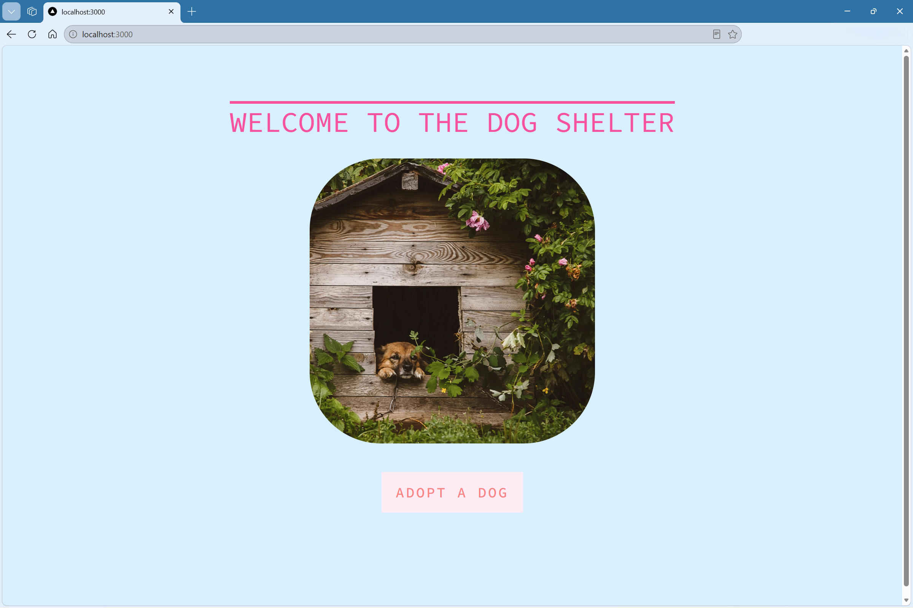
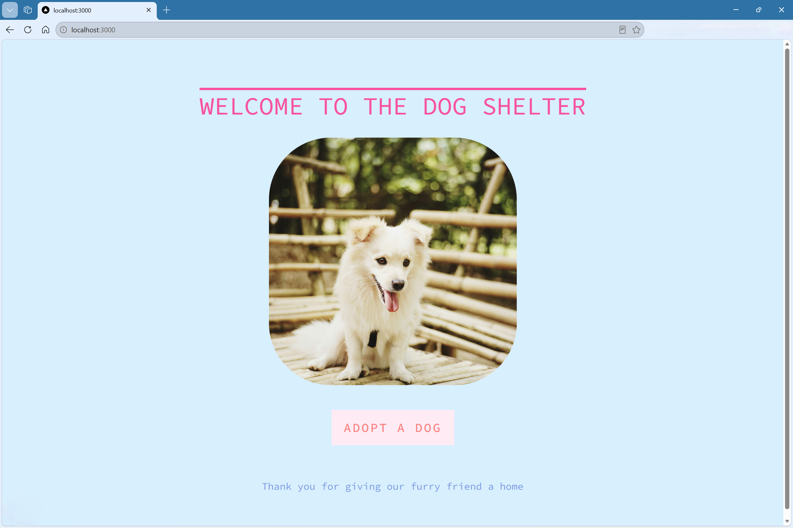

# Dog Shelter Adoption App
**Live Demo**: https://dog-shelter-nextjs.vercel.app/

An interactive web application that simulates dog adoption. Built using Next.js, React, TypeScript, and CSS.

## Features
- Randomized dog image gallery
- Button-driven image switching
- Smooth UI interactions
- Dynamic message reveal on adoption
- Clean, centered UI using Flexbox
- Custom color palette using CSS variables


## Tech Stack
- Next.js
- React
- TypeScript
- CSS (Flexbox, CSS Variables)


## How to run
```bash
npm install
npm run dev
```
Open http://localhost:3000 in your browser.


## Project Structure
```text
app/
├── page.tsx
├── adopt-button.tsx
├── layout.tsx
└── globals.css

public/
└── imgs/

screenshots/
├── home.png
└── adoption.png
```


## Screenshots






## What I Learned

This project began as a vanilla HTML/CSS/JavaScript application and was later migrated to Next.js and React. Through this conversion, I learned:

- React state management with `useState`
- Client vs. Server Components in Next.js
- Component-based architecture
- TypeScript fundamentals and type safety
- Project organization in modern React applications
- Git, GitHub, and Vercel deployment workflows

## Deployment

This application is deployed on Vercel and automatically redeploys whenever changes are pushed to the `main` branch.

## Credits
The original HTML project that I based this Next.js project on was built while following the [HTML/CSS/JS Crash Course by Colt Steele](https://youtube.com/playlist?list=PLblA84xge2_y8F1K0wzPia9V_ULVcfg4k&si=GueLCDicRxK3Z5vN).

All images used in this project are from [Pexels](https://www.pexels.com/).
